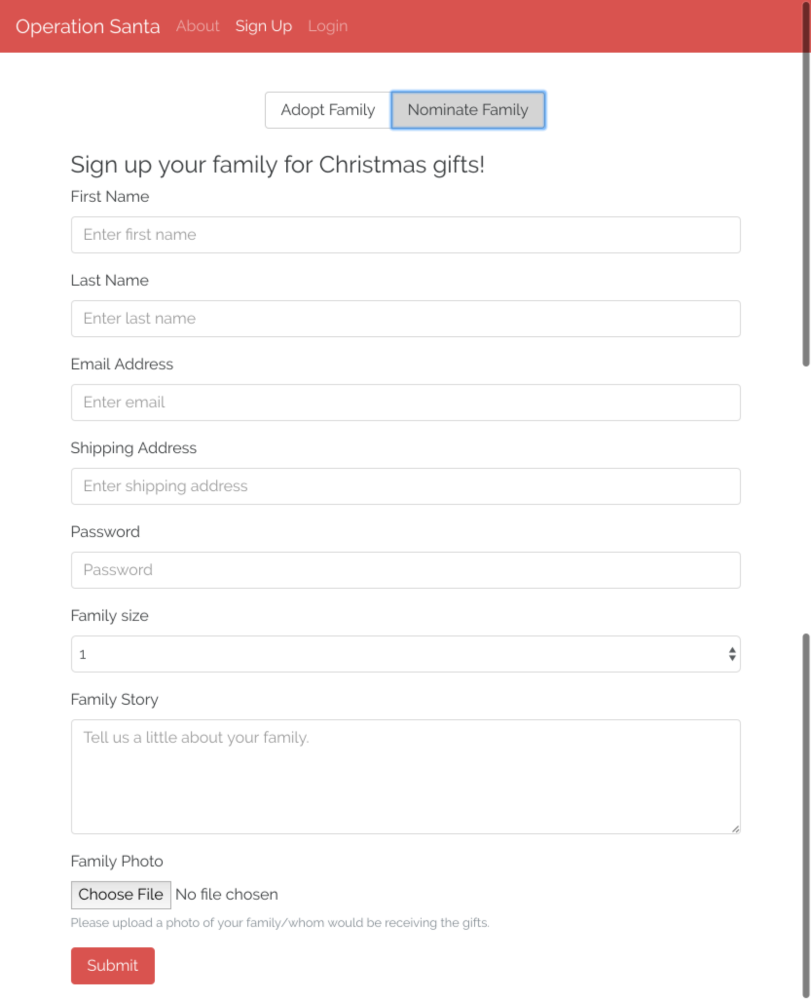
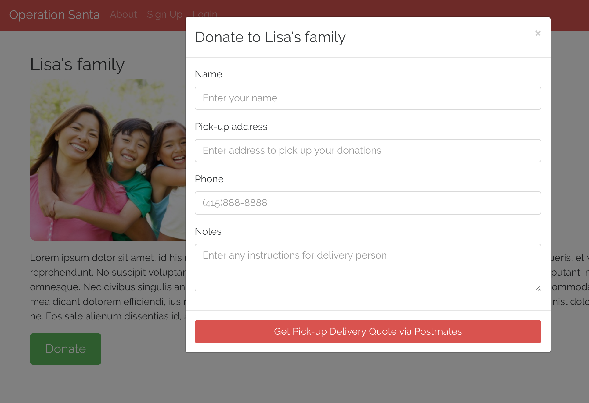
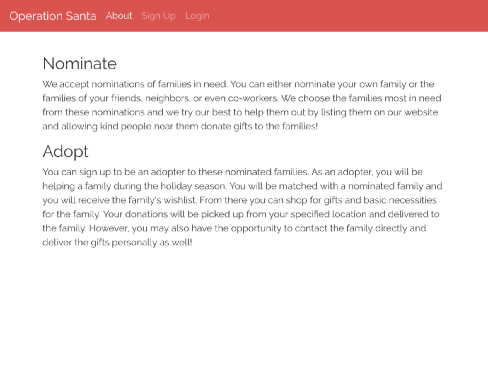
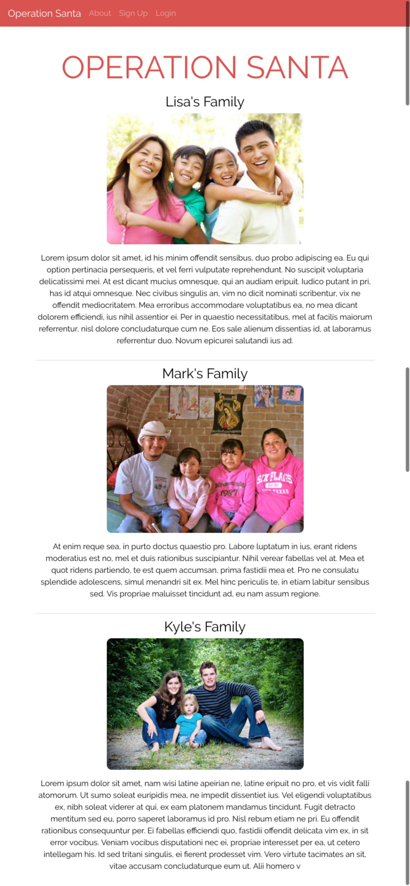

# Operation Santa
Give a warm Christmas gift to families who are in need.

## Description
This web app supports universal rendering via ReactJS, routing with React-Router, and [Postmates' API](https://postmates.com/developer/docs) to get delivery quotes and create deliveries for users. There is no flux implementation as this was meant to be a small project (MVP).

## Prerequisites
- [Operation Santa API](https://github.com/phchung/API-Operation-Santa)
- Alternative to API pre-req: Checkout 'live' branch instead

## Tech stack
- [React](https://github.com/facebook/react)
- [Redux](https://github.com/reactjs/redux)
- [React Router](https://github.com/ReactTraining/react-router)
- [React Router Redux](https://github.com/ReactTraining/react-router/tree/master/packages/react-router-redux)
- [Redux Thunk](https://github.com/gaearon/redux-thunk)
- [Webpack](https://github.com/webpack/webpack)
- [Twitter Bootstrap](https://github.com/twbs/bootstrap)

## To run

```sh
npm install

# Transpile and bundle client, server, and test files
npm run build

# Start server
npm start
```

And visit <http://localhost:4000/> to access GUI.

## Todo
- Refactor excessive Container content into smaller components

## Preview







